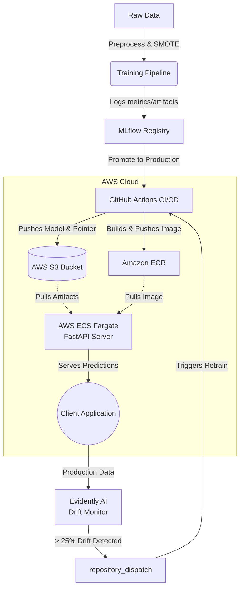

# 🛡️ End-to-End Fraud Detection MLOps Pipeline

An enterprise-grade, end-to-end MLOps reference implementation demonstrating the complete machine learning lifecycle: data ingestion, experiment tracking, continuous integration/continuous training (CI/CD/CT), automated drift detection, and serverless AWS deployment.

## 🏗️ Architecture



## ✨ Key Features

- **Data Preprocessing & Balancing**: Handled severe class imbalance (0.17% fraud) on a 284k+ row dataset using Synthetic Minority Oversampling Technique (SMOTE).
- **Experiment Tracking**: Integrated **MLflow** for hyperparameter tracking, metric logging, and model registry.
- **Explainable AI (XAI)**: Automated generation and logging of **SHAP** summary plots for model transparency and feature importance analysis.
- **CI/CD/CT Pipeline**: Robust **GitHub Actions** workflows for automated testing, Docker image building, AWS pushing, and continuous training.
- **Serverless Cloud Deployment**: Fully automated Infrastructure-as-Code (IaC) via **AWS CloudFormation**. Deploys the FastAPI application to **AWS ECS Fargate**, utilizing an S3 pointer architecture to securely load version-controlled artifacts dynamically at runtime.
- **Least-Privilege Security**: Custom AWS IAM Roles ensuring the ECS tasks only have exact permissions to read from the specific S3 bucket and pull from ECR.
- **Automated Drift Detection**: **Evidently AI** monitors production data for statistical drift. Automatically triggers a GitHub Actions webhook to retrain the model if >25% of features drift.

## 🛠️ Tech Stack

- **Machine Learning**: Scikit-Learn (Random Forest), imbalanced-learn (SMOTE), SHAP
- **MLOps & Monitoring**: MLflow, Evidently AI
- **Serving**: FastAPI, Uvicorn, Docker
- **CI/CD**: GitHub Actions
- **Cloud Infrastructure (AWS)**: Amazon S3, Amazon ECR, Amazon ECS (Fargate), AWS CloudFormation, AWS IAM

## 📊 Dataset & Model Performance

Trained on the [Kaggle Credit Card Fraud Detection](https://www.kaggle.com/datasets/mlg-ulb/creditcardfraud) dataset (284,807 transactions, 492 frauds).

| Model | n_estimators | max_depth | class_weight | SMOTE | ROC-AUC | Avg Precision | F1 Score |
|---|---|---|---|---|---|---|---|
| Random Forest | 100 | None | balanced | ✅ | **0.9988** | **0.8296** | **0.8571** |

> **Drift Threshold Justification**: A **DataDriftPreset** via Evidently is configured with a drift share threshold of `0.25` (25%). Fraud detection models are highly sensitive to shifts in PCA-transformed features. If >25% of features drift, the underlying transaction behavior has fundamentally changed, strongly indicating the model's learned decision boundaries are outdated and a retrain is required.

## 🚀 Quickstart

### 1. Local Setup
```bash
# Install dependencies
pip install -e ".[dev,serving,monitoring,dashboard]"

# Download dataset (requires KAGGLE_USERNAME and KAGGLE_KEY)
python -m src.data.download

# Run training pipeline locally
python -m src.training.train

# Set production model alias and push artifacts
python scripts/promote_model.py

# Launch MLflow UI to view experiments
mlflow ui --backend-store-uri sqlite:///mlruns.db
```

### 2. Testing Drift Detection
```bash
# Simulate data drift
python -m src.monitoring.simulate_drift 200 amount_shift

# Run the drift detector
python -m src.monitoring.drift_detector
```

### 3. Dashboard
```bash
# Launch the Streamlit dashboard
streamlit run src/dashboard/app.py
```

### 4. AWS Deployment
The pipeline is fully automated via GitHub Actions, but relies on the following AWS prerequisites:
1. An S3 Bucket for artifacts (e.g., `s3://your-mlflow-artifacts-bucket`)
2. An ECR Repository (e.g., `fraud-detection`)
3. GitHub Secrets configured (`AWS_ACCESS_KEY_ID`, `AWS_SECRET_ACCESS_KEY`, `KAGGLE_JSON`, `GH_PAT`)

Once the CI/CD pipeline runs and populates S3 and ECR, deploy the infrastructure:
```bash
# Deploy the ECS Fargate cluster via CloudFormation
aws cloudformation create-stack \
  --stack-name fraud-ecs-stack \
  --template-body file://infra/ecs_fargate.yaml \
  --capabilities CAPABILITY_NAMED_IAM
```

## 📈 Project Phases

- **Phase 1** ✅ Data Pipeline & Experiment Tracking (MLflow)
- **Phase 2** ✅ API Development (FastAPI + Docker)
- **Phase 3** ✅ CI/CD Pipeline (GitHub Actions)
- **Phase 4** ✅ Cloud Deployment (AWS ECS Fargate + S3 Artifacts + CloudFormation)
- **Phase 5** ✅ Continuous Training & Drift Detection (Evidently)

---
*Developed as a comprehensive reference architecture for production-grade Machine Learning Systems.*
